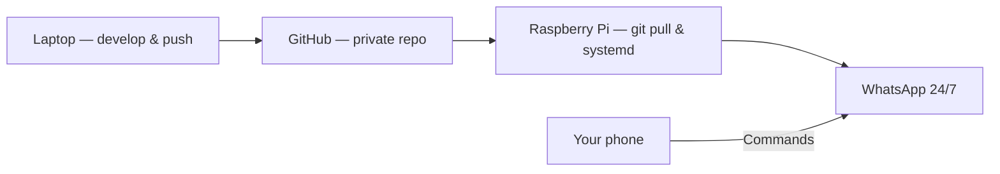

# Sandesha — Raspberry Pi Setup Guide

Run Sandesha 24/7 on a Raspberry Pi at home. GitHub stores your code; the Pi runs the bot.

---

## What you need

| Item | Recommendation |
|------|----------------|
| Board | **Raspberry Pi 4** (2 GB RAM minimum; 4 GB safer) or Pi 5 |
| Storage | 16 GB+ microSD (32 GB recommended) |
| Power | Official Pi power supply (avoid weak phone chargers) |
| Network | Stable home Wi‑Fi or Ethernet |
| OS | **Raspberry Pi OS Lite (64-bit)** — no desktop required |
| WhatsApp | Your phone to scan the QR code once |

Sandesha uses **Puppeteer + Chromium** for WhatsApp Web. A Pi 3 or 1 GB RAM can struggle; Pi 4 2 GB+ is the practical minimum.

---

## Checklist overview

- [ ] 1. Flash Raspberry Pi OS and boot
- [ ] 2. Update system and install Node.js 18+
- [ ] 3. Install Chromium (system browser for Puppeteer)
- [ ] 4. Clone Sandesha from GitHub
- [ ] 5. Install npm dependencies (skip bundled Chromium)
- [ ] 6. Copy personal config (`groups.json`, commands group JID)
- [ ] 7. First run — scan WhatsApp QR
- [ ] 8. Verify bot and API
- [ ] 9. Enable `systemd` auto-start on boot
- [ ] 10. Set up updates and backups

---

## 1. Flash OS and first boot

1. Install [Raspberry Pi Imager](https://www.raspberrypi.com/software/).
2. Choose **Raspberry Pi OS Lite (64-bit)**.
3. In imager settings (gear icon):
   - Set hostname: e.g. `sandesha-pi`
   - Enable SSH (password or key)
   - Set username/password
   - Configure Wi‑Fi if not using Ethernet
4. Flash the SD card, insert into Pi, power on.

SSH from your computer:

```bash
ssh pi@sandesha-pi.local
# or: ssh pi@<PI_IP_ADDRESS>
```

---

## 2. System update and Node.js

```bash
sudo apt update && sudo apt full-upgrade -y
sudo apt install -y git curl build-essential
```

### Install Node.js 20 (recommended)

```bash
curl -fsSL https://deb.nodesource.com/setup_20.x | sudo -E bash -
sudo apt install -y nodejs
node --version   # should be v18+ 
npm --version
```

---

## 3. Install Chromium for Puppeteer

Sandesha can use system Chromium instead of downloading its own (saves ~300 MB and RAM on the Pi).

```bash
sudo apt install -y chromium-browser fonts-liberation libatk-bridge2.0-0 libgtk-3-0
```

Find the Chromium path:

```bash
which chromium || which chromium-browser
```

Typical paths:

- `/usr/bin/chromium` (Bookworm / newer)
- `/usr/bin/chromium-browser` (older images)

Set it permanently for your user:

```bash
echo 'export PUPPETEER_EXECUTABLE_PATH=/usr/bin/chromium' >> ~/.bashrc
# If `which chromium` showed chromium-browser instead, use that path.
source ~/.bashrc
```

### Optional: add swap (helps on 2 GB Pi)

```bash
sudo dphys-swapfile swapoff
sudo sed -i 's/CONF_SWAPSIZE=.*/CONF_SWAPSIZE=2048/' /etc/dphys-swapfile
sudo dphys-swapfile setup
sudo dphys-swapfile swapon
```

---

## 4. Clone from GitHub

```bash
mkdir -p ~/apps && cd ~/apps
git clone https://github.com/YOUR_USER/sandesha.git
cd sandesha
```

Use a **private** repo if the project contains group names or internal config.

---

## 5. Install dependencies

Skip Puppeteer’s bundled Chromium — use system Chromium instead:

```bash
cd ~/apps/sandesha
PUPPETEER_SKIP_DOWNLOAD=1 npm install
```

Or use the npm script:

```bash
npm run install:no-browser
```

---

## 6. Personal configuration

These files are **not** committed to GitHub (see `.gitignore`). Copy them from your dev machine or recreate them on the Pi.

### `groups.json`

Copy from your laptop:

```bash
# From your laptop:
scp groups.json pi@sandesha-pi.local:~/apps/sandesha/
```

Or create manually — see [SETUP_GUIDE.md](SETUP_GUIDE.md) section 2.

### Commands group JID

Edit `listen.js` on the Pi if your **Me Commands** group JID differs:

```javascript
const COMMANDS_GROUP_JID = 'YOUR_GROUP_JID@g.us';
```

Find JIDs after first connect: `node send.js --list`

### Other local files (optional)

| File | Purpose |
|------|---------|
| `schedules.json` | Scheduled messages |
| `contacts.json` | Named contacts |
| `state.json` | Auto-created at runtime |
| `.env` | Optional secrets / overrides |

---

## 7. First run — link WhatsApp

Run interactively the first time (not via systemd yet):

```bash
cd ~/apps/sandesha
export PUPPETEER_EXECUTABLE_PATH=/usr/bin/chromium   # if not in .bashrc yet
./start.sh
```

### Scan the QR code

The Pi has no screen. Use one of these:

**Option A — Terminal QR (SSH)**  
If your SSH client supports it, scan the ASCII QR shown in the terminal.

**Option B — Copy `qr-code.png` (easiest)**  
In another terminal on your laptop:

```bash
scp pi@sandesha-pi.local:~/apps/sandesha/qr-code.png .
```

Open the image on your phone, or AirDrop/share it. Then in WhatsApp:

**Settings → Linked Devices → Link a Device** and scan.

**Option C — Reset and re-scan later**

```bash
./start.sh --reset
```

Wait until you see logs like:

```
WhatsApp connected
Send server on http://127.0.0.1:42620
Setup complete!
```

Press `Ctrl+C` to stop — next step sets up auto-start.

---

## 8. Verify

On the Pi:

```bash
# Start in background for a quick test
./start.sh &
sleep 30
curl http://127.0.0.1:42620/health
curl http://127.0.0.1:42620/groups
```

In WhatsApp **Me Commands** group, send:

```
!help
```

You should get a reply within a few seconds.

---

## 9. Auto-start with systemd

Create a service so Sandesha starts on boot and restarts after crashes.

```bash
sudo nano /etc/systemd/system/sandesha.service
```

Paste (adjust `User` and paths):

```ini
[Unit]
Description=Sandesha WhatsApp Bot
After=network-online.target
Wants=network-online.target

[Service]
Type=simple
User=pi
WorkingDirectory=/home/pi/apps/sandesha
Environment=PUPPETEER_EXECUTABLE_PATH=/usr/bin/chromium
Environment=NODE_ENV=production
EnvironmentFile=/home/pi/apps/sandesha/.env
ExecStart=/usr/bin/node /home/pi/apps/sandesha/listen.js
Restart=on-failure
RestartSec=15
TimeoutStopSec=30

# Chromium / Puppeteer on small boards
LimitNOFILE=65536

[Install]
WantedBy=multi-user.target
```

If Chromium is at `chromium-browser`, change `PUPPETEER_EXECUTABLE_PATH` accordingly.

Enable and start:

```bash
sudo systemctl daemon-reload
sudo systemctl enable sandesha
sudo systemctl start sandesha
sudo systemctl status sandesha
```

Useful commands:

```bash
sudo systemctl restart sandesha    # restart bot
sudo systemctl stop sandesha       # stop bot
journalctl -u sandesha -f          # live service logs
tail -f ~/apps/sandesha/sandesha.log
```

### Stale lock after crash

If the service fails with “Bot is already running”:

```bash
sudo systemctl stop sandesha
rm -f ~/apps/sandesha/.lock
pkill -f "user-data-dir=.*wwebjs_auth" 2>/dev/null || true
sudo systemctl start sandesha
```

---

## 10. Updating from GitHub

```bash
cd ~/apps/sandesha
sudo systemctl stop sandesha
git pull
PUPPETEER_SKIP_DOWNLOAD=1 npm install
sudo systemctl start sandesha
```

**Do not** delete `.wwebjs_auth/` during updates — that would force a new QR scan.

---

## What belongs in `.gitignore` (never push to GitHub)

Your repo already ignores sensitive and machine-local data. Keep these **off GitHub**:

| Path | Why |
|------|-----|
| `.wwebjs_auth/` | WhatsApp session — anyone with this can use your account |
| `.wwebjs_cache/` | Browser cache tied to session |
| `.baileys_auth/` | Alternate auth store |
| `groups.json` | Your group JIDs (private) |
| `schedules.json` | Your scheduled messages |
| `contacts.json` | Personal contacts |
| `state.json` | Runtime state |
| `.lock` | Process lock (runtime only) |
| `*.log`, `notifications.log` | Activity logs |
| `qr-code.png` | QR used to link device |
| `media/` | Downloaded/sent media |
| `.env` | API keys and secrets |
| `node_modules/` | Dependencies (reinstall on Pi) |

### Recommended additions

If not already present, add to `.gitignore`:

```
.lock
state.json
output.txt
```

### Safe to commit

- Source code (`listen.js`, `send.js`, `settings.js`, scripts)
- `SETUP_GUIDE.md`, `RASPBERRY_PI_SETUP.md`
- Example/template configs (e.g. `groups.json.example` with fake JIDs)

---

## Accessing the API from other devices (optional)

By default the HTTP API binds to `127.0.0.1` (Pi only).

### SSH tunnel (private, no Cloudflare)

```bash
ssh -L 42620:127.0.0.1:42620 pi@sandesha-pi.local
```

Then open **http://127.0.0.1:42620/** on your laptop.

### Cloudflare Tunnel (GitHub Pages + HTTPS)

For the web dashboard hosted on GitHub Pages, use a Cloudflare Tunnel so the Pi API is reachable over HTTPS.

1. Set `SANDESHA_ADMIN_PASSWORD` in `.env` (copy from `.env.example`)
2. Follow [docs/DEPLOY_CLOUDFLARE.md](docs/DEPLOY_CLOUDFLARE.md)
3. Set `docs/config.js` `apiUrl` to your tunnel URL (e.g. `https://sandesha.yourdomain.com`)
4. Enable GitHub Pages from the `/docs` folder

The API requires a Bearer token (login via web UI or `POST /auth/login`). Do **not** expose the tunnel without setting the admin password first.

See also [docs/README.md](docs/README.md) for the full GitHub Pages workflow.

---

## Troubleshooting (Pi-specific)

| Problem | Fix |
|---------|-----|
| Chromium fails to start | Confirm `PUPPETEER_EXECUTABLE_PATH`, run `chromium --version` |
| Out of memory / killed | Add swap (step 3), use Pi 4 2 GB+, close other services |
| Session drops often | Use Ethernet; avoid Pi undervoltage (check `vcgencmd get_throttled`) |
| QR expired | `./start.sh --reset` and scan again quickly |
| `Bot is already running` | `rm -f .lock`, stop duplicate systemd/manual processes |
| Schedule missed during outage | Bot only fires while running — use `systemd` + UPS optional |
| After power cut | systemd should auto-start; re-scan only if session corrupted |

Check Pi health:

```bash
vcgencmd get_throttled   # 0x0 = OK; non-zero = power/thermal issues
free -h
df -h
```

---

## GitHub + Pi workflow (summary)



1. **GitHub** — code backup, version history, `git pull` on Pi  
2. **Raspberry Pi** — runs `listen.js` 24/7 via systemd  
3. **Phone** — scan QR once; send commands in Me Commands group  

---

## Quick reference

```bash
# Manual start
cd ~/apps/sandesha && ./start.sh

# Service
sudo systemctl status sandesha
sudo systemctl restart sandesha

# Logs
tail -f ~/apps/sandesha/sandesha.log
journalctl -u sandesha -f

# Health
curl http://127.0.0.1:42620/health

# Re-link WhatsApp
sudo systemctl stop sandesha
./start.sh --reset
# scan QR, then re-enable systemd
sudo systemctl start sandesha
```

See also: [SETUP_GUIDE.md](SETUP_GUIDE.md) for bot usage, commands, and API.
